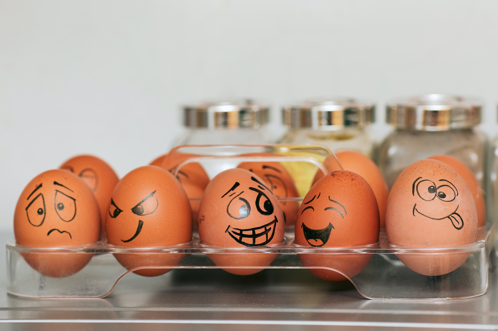

# Comparing Human-labeled and tool-labeled Sentiment


Prepared and presented by: [Leah Pope](https://www.linkedin.com/in/leahspope/) 

Blog:[Coming Soon!](https://leahspope7.medium.com/)




# Introduction

The goal of this experiment is to compare human labeled sentiment (the gold standard) to tool labeled sentiment using [VADER (Valence Aware Dictionary and sEntiment Reasoner)](https://github.com/cjhutto/vaderSentiment) and [Text Blob](https://github.com/sloria/textblob).

This is a follow-on from my [Flatiron Phase 4 Project](https://github.com/lspope/dsc-phase-4-project) where I built a text classifer to classify Tweets as either Positive, Negative, or Neutral. 


# Data
The datasets used in this experiment are from [CrowdFlower](https://data.world/crowdflower)
* [Product Emotions](https://data.world/crowdflower/brands-and-product-emotions)
* [Apple Tweets](https://data.world/crowdflower/apple-twitter-sentiment)


# Repository Structure
```
--notebooks
----data_cleaning.ipynb
----comparision.ipynb
--data (dir for all raw and processed data files)
--images (dir for images)
```